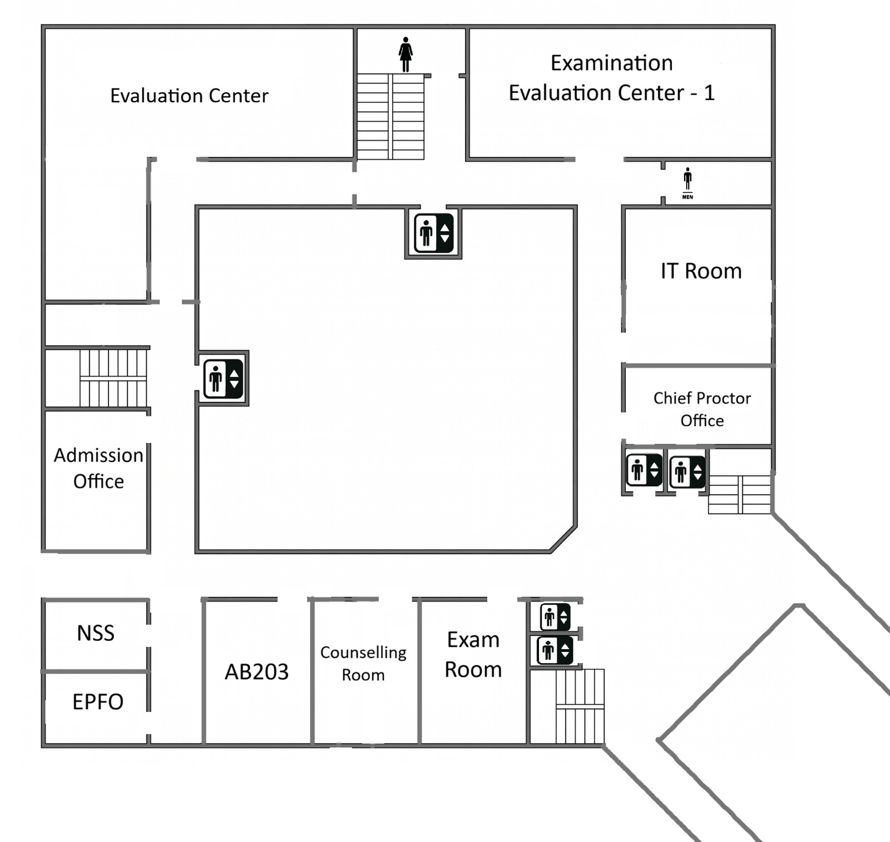
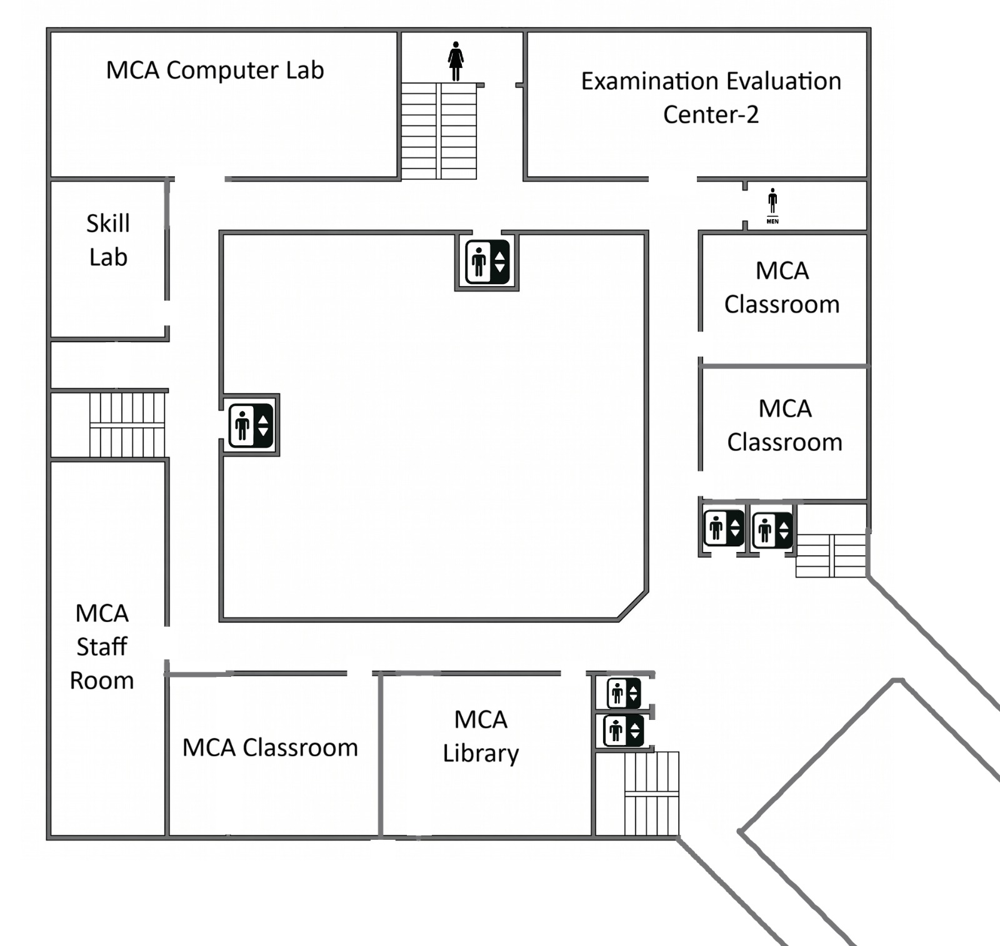
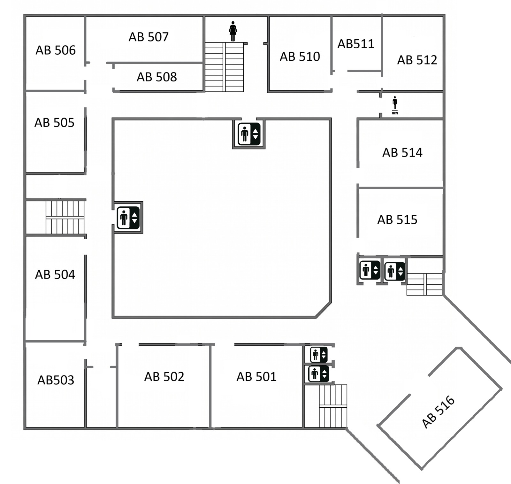
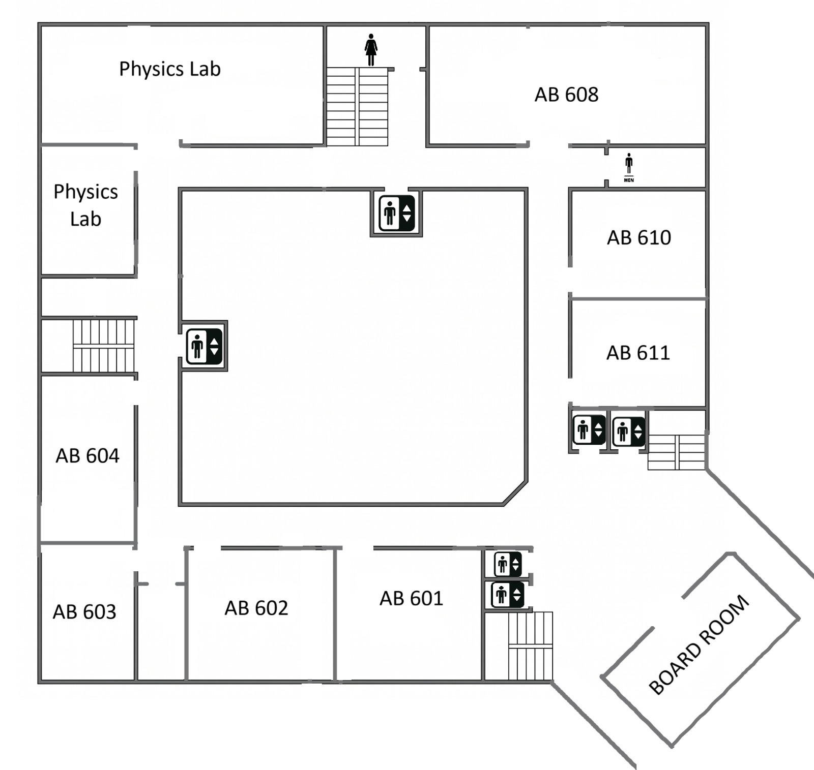
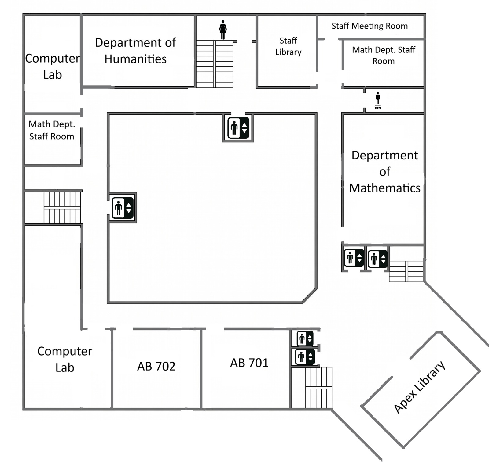

# SmartNav Project Context File

This document contains the complete context, architectural breakdown, and raw source code for the **SmartNav Indoor Navigation System**. You can upload this file to any LLM or AI assistant to generate explanations, user manuals, presentations, speeches, reviews, or refactoring recommendations.

**Live Demo URL:** [https://idpbl.vercel.app](https://idpbl.vercel.app)

---

## 👥 Contributors & Credits

This project was built by:
*   **Aditya G Nair**
*   **Akula Vaenkata Saye Chandan**
*   **B. Gayathri Prajwal**
*   **Guthikonda Navatej**

Released under the [MIT License](LICENSE).

---

## 📖 Table of Contents
1. [Project Overview & Architecture](#-project-overview--architecture)
2. [Graph & Routing Design Concepts](#-graph--routing-design-concepts)
3. [UI, Visuals & Interactions](#-ui-visuals--interactions)
4. [Deployment Details](#-deployment-details)
5. [Source Code Index](#-source-code-index)
   * [index.html](#1-indexhtml)
   * [styles.css](#2-stylescss)
   * [buildingData.js](#3-buildingdatajs)
   * [pathfinding.js](#4-pathfindingjs)
   * [app.js](#5-appjs)
   * [coord_picker.html](#6-coord_pickerhtml)
   * [corridor_editor.html](#7-corridor_editorhtml)
   * [grid_view.html](#8-grid_viewhtml)
   * [view_floors.html](#9-view_floorshtml)

---

## 🏢 Project Overview & Architecture

SmartNav is a serverless, client-side web application designed to render interactive floor plan maps and compute the shortest pathways between coordinates inside a multi-floor building.

The architecture comprises three core pillars:
1.  **Data Schema (`buildingData.js`):** Houses room coordinates, vertical elevator/stair structures, and dynamically generates orthogonal corridor network nodes.
2.  **Algorithm Core (`pathfinding.js`):** Employs **A\*** search (or **Dijkstra** as a fallback) to trace paths through same-floor corridors or across multiple floors using staircase/elevator transition segments.
3.  **UI Controller & Canvas Renderer (`app.js`):** Interacts with `index.html` and `styles.css`. It features mouse/touch-controlled translation (drag to pan, scroll to zoom) and overlays dynamically calculated lines on top of scale-matching floor plan images.

---

## 🧭 Graph & Routing Design Concepts

To construct realistic walking paths and avoid "wall clipping" (drawing lines directly through solid room dividers):
*   **Doorway Anchors:** Every room has a corresponding hidden doorway node (`_DOOR_<RoomName>`). Rooms are *only* allowed to connect to their own door nodes, never directly to adjacent rooms.
*   **Corridor Backbone:** Doorway nodes connect directly to the nearest points on the corridor grid. Walking paths are routed through this corridor backbone.
*   **Orthogonal Corridor Routing:** Corridors are kept orthogonal (right-angled paths aligned horizontally or vertically) to mimic natural corridor layouts.
*   **Threshold Connectivity:** Nodes on the same floor connect automatically if they fall within a threshold distance of 380 pixels.
*   **Vertical Transit Logic:** Stairs and Elevators exist as coordinates spanning multiple floors. The algorithm searches for paths by routing to the stair/elevator node on the start floor, transferring floors, and navigating from the stair/elevator on the destination floor to the target room.

---

## 🎨 UI, Visuals & Interactions

*   **Custom Styling:** Utilizes CSS Custom Properties (`--primary`, `--surface`, `--border`, etc.) with a clean dark/glassmorphic intro overlay card and dynamic sidebars.
*   **Canvas Layering:** Stacked exactly over the floor image, adjusting its drawing coordinates using rendering scales derived from natural image dimensions versus container sizes.
*   **Pan & Zoom Math:** Tracks mouse/wheel coordinates to apply CSS transforms (`translate` and `scale`) dynamically onto the canvas and label wrapper.

---

## 🚀 Deployment Details

*   **Platform:** Vercel (`idpbl.vercel.app`)
*   **Configuration:** Static Site Deployment. Because the codebase uses standard HTML, CSS, and client-side JavaScript, no build command or install command is required.
*   **Asset Paths:** Uses relative paths for all scripts, styles, and floor plan images (e.g., `floor1.jpeg`), making it instantly portable to any static hosting provider (Vercel, GitHub Pages, Netlify, or AWS S3).

---

## 📂 Source Code Index

### 1. [index.html](file:///d:/Programing%20class/github/IDT/IDPBL%20%281%29/IDPBL/index.html)
The primary layout file containing the search bar, floor selectors, canvas viewer, legend, and dynamic navigation panels.

```html
<!DOCTYPE html>
<html lang="en">
<head>
    <meta charset="UTF-8">
    <meta name="viewport" content="width=device-width, initial-scale=1.0">
    <title>SmartNav - Indoor Navigation System</title>
    <link href="https://fonts.googleapis.com/css2?family=Outfit:wght@300;400;500;600;700&display=swap" rel="stylesheet">
    <!-- Font Awesome for icons -->
    <link rel="stylesheet" href="https://cdnjs.cloudflare.com/ajax/libs/font-awesome/6.4.0/css/all.min.css">
    <link rel="stylesheet" href="styles.css">
</head>
<body>
    <!-- Intro Overlay -->
    <div id="introOverlay" class="intro-overlay">
        <div class="intro-card">
            <div class="intro-icon">
                <i class="fa-solid fa-location-dot"></i>
            </div>
            <h1>SMARTNAV</h1>
            <h2>INDOOR NAVIGATION SYSTEM</h2>
            <p>Find your way. Anywhere, Inside.</p>
            <button id="startNavBtn" class="btn-primary-large">START NAVIGATION</button>
        </div>
    </div>

    <div class="app-container">
        <!-- Top Navigation Bar -->
        <header class="top-bar">
            <div class="logo">
                <i class="fa-solid fa-map-location-dot"></i>
                <span>SmartNav</span>
            </div>
            
            <div class="search-container">
                <i class="fa-solid fa-magnifying-glass search-icon"></i>
                <input type="text" id="searchInput" placeholder="Search for a location..." autocomplete="off">
                <button id="clearSearchBtn" class="clear-btn hidden"><i class="fa-solid fa-xmark"></i></button>
                <div id="searchResults" class="search-dropdown hidden"></div>
            </div>

            <div class="controls-container">
                <div class="floor-selector">
                    <span class="floor-label">Floor:</span>
                    <button class="floor-btn active" data-floor="1">1</button>
                    <button class="floor-btn" data-floor="2">2</button>
                    <button class="floor-btn" data-floor="3">3</button>
                    <button class="floor-btn" data-floor="4">4</button>
                    <button class="floor-btn" data-floor="5">5</button>
                </div>
                <button class="menu-btn"><i class="fa-solid fa-bars"></i></button>
            </div>
        </header>

        <!-- Main Content Area -->
        <main class="main-content">
            <!-- Map Container -->
            <div class="map-area">
                <div class="floor-viewer" id="floorViewer">
                    <div class="image-wrapper" id="imageWrapper">
                        
                        <canvas id="pathCanvas" class="path-canvas"></canvas>
                        <div id="roomLabels" class="room-labels"></div>
                    </div>
                </div>

                <!-- Floating Legend -->
                <div class="floating-legend" id="legend">
                    <h4>Legend</h4>
                    <div class="legend-item"><span class="dot start"></span> Start Point</div>
                    <div class="legend-item"><span class="dot end"></span> Destination</div>
                    <div class="legend-item"><span class="line"></span> Path</div>
                </div>
            </div>

            <!-- Left Panel: Location Info (Pops up when a location is selected) -->
            <div id="locationPanel" class="side-panel left-panel hidden">
                <button class="close-panel-btn" onclick="app.closeLocationPanel()"><i class="fa-solid fa-xmark"></i></button>
                <div class="panel-tag">Destination</div>
                <h3 id="locName">Room Name</h3>
                <p id="locDetails" class="loc-details">Floor 1</p>
                
                <div class="start-selection">
                    <label>Start from:</label>
                    <select id="startLocationSelect" class="modern-select">
                        <option value="">Select starting point...</option>
                    </select>
                </div>

                <button id="navigateBtn" class="btn-navigate">
                    <i class="fa-solid fa-route"></i> NAVIGATE
                </button>
                <div id="errorMsg" class="error-msg hidden"></div>
            </div>

            <!-- Right Panel: Navigation Steps (Pops up when navigating) -->
            <div id="stepsPanel" class="side-panel right-panel hidden">
                <button class="close-panel-btn" onclick="app.closeStepsPanel()"><i class="fa-solid fa-xmark"></i></button>
                <h3>Navigation Steps</h3>
                <div id="pathSteps" class="steps-list">
                    <!-- Steps will be populated here -->
                </div>
            </div>
        </main>
    </div>

    <script src="buildingData.js?v=12"></script>
    <script src="pathfinding.js?v=12"></script>
    <script src="app.js?v=12"></script>
</body>
</html>
```

---

### 2. [styles.css](file:///d:/Programing%20class/github/IDT/IDPBL%20%281%29/IDPBL/styles.css)
The application stylesheet controlling styling, responsiveness, typography, layouts, and interactive micro-animations.

```css
:root {
    --primary: #4361ee;
    --primary-hover: #3f37c9;
    --bg-color: #f8f9fa;
    --surface: #ffffff;
    --text-main: #2b2d42;
    --text-muted: #8d99ae;
    --border: #edf2f4;
    --start-color: #4caf50;
    --end-color: #f72585;
    --shadow-sm: 0 2px 10px rgba(0, 0, 0, 0.05);
    --shadow-md: 0 8px 30px rgba(0, 0, 0, 0.08);
    --shadow-lg: 0 20px 40px rgba(0, 0, 0, 0.12);
    --radius-sm: 8px;
    --radius-md: 16px;
    --radius-lg: 24px;
    --radius-pill: 50px;
}

* {
    margin: 0;
    padding: 0;
    box-sizing: border-box;
    font-family: 'Outfit', sans-serif;
}

body {
    background-color: var(--bg-color);
    color: var(--text-main);
    overflow: hidden; /* Prevent body scroll */
    height: 100vh;
    width: 100vw;
}

/* ================== INTRO OVERLAY ================== */
.intro-overlay {
    position: fixed;
    top: 0; left: 0; width: 100vw; height: 100vh;
    background: rgba(255, 255, 255, 0.85);
    backdrop-filter: blur(10px);
    display: flex;
    justify-content: center;
    align-items: center;
    z-index: 10000;
    transition: opacity 0.5s ease, visibility 0.5s ease;
}

.intro-overlay.hidden {
    opacity: 0;
    visibility: hidden;
}

.intro-card {
    background: var(--surface);
    padding: 50px;
    border-radius: var(--radius-lg);
    box-shadow: var(--shadow-lg);
    text-align: center;
    max-width: 450px;
    width: 90%;
    transform: translateY(0);
    transition: transform 0.5s cubic-bezier(0.175, 0.885, 0.32, 1.275);
}

.intro-overlay.hidden .intro-card {
    transform: translateY(50px);
}

.intro-icon {
    font-size: 64px;
    color: var(--end-color);
    margin-bottom: 20px;
    animation: bounce 2s infinite;
}

@keyframes bounce {
    0%, 20%, 50%, 80%, 100% { transform: translateY(0); }
    40% { transform: translateY(-20px); }
    60% { transform: translateY(-10px); }
}

.intro-card h1 {
    font-size: 2.5em;
    font-weight: 700;
    letter-spacing: 2px;
    color: var(--text-main);
    margin-bottom: 5px;
}

.intro-card h2 {
    font-size: 1em;
    font-weight: 600;
    color: var(--text-muted);
    letter-spacing: 1px;
    margin-bottom: 20px;
}

.intro-card p {
    font-size: 1.1em;
    color: var(--primary);
    margin-bottom: 40px;
    font-weight: 500;
}

.btn-primary-large {
    background: var(--primary);
    color: white;
    border: none;
    padding: 16px 32px;
    font-size: 1.1em;
    font-weight: 600;
    border-radius: var(--radius-pill);
    cursor: pointer;
    box-shadow: 0 4px 15px rgba(67, 97, 238, 0.3);
    transition: all 0.3s ease;
    width: 100%;
}

.btn-primary-large:hover {
    background: var(--primary-hover);
    transform: translateY(-2px);
    box-shadow: 0 8px 25px rgba(67, 97, 238, 0.4);
}

/* ================== APP CONTAINER ================== */
.app-container {
    display: flex;
    flex-direction: column;
    height: 100vh;
}

/* ================== TOP BAR ================== */
.top-bar {
    height: 80px;
    background: var(--surface);
    box-shadow: var(--shadow-sm);
    display: flex;
    align-items: center;
    justify-content: space-between;
    padding: 0 30px;
    z-index: 100;
}

.logo {
    display: flex;
    align-items: center;
    gap: 12px;
    font-size: 1.5em;
    font-weight: 700;
    color: var(--primary);
}

.search-container {
    position: relative;
    width: 400px;
    max-width: 40%;
}

.search-container input {
    width: 100%;
    padding: 14px 45px 14px 45px;
    border: 2px solid var(--border);
    border-radius: var(--radius-pill);
    font-size: 1em;
    font-weight: 500;
    outline: none;
    transition: all 0.3s ease;
    background: #f4f6f8;
    color: var(--text-main);
}

.search-container input:focus {
    background: var(--surface);
    border-color: var(--primary);
    box-shadow: 0 0 0 4px rgba(67, 97, 238, 0.1);
}

.search-icon {
    position: absolute;
    left: 18px;
    top: 50%;
    transform: translateY(-50%);
    color: var(--text-muted);
}

.clear-btn {
    position: absolute;
    right: 15px;
    top: 50%;
    transform: translateY(-50%);
    background: none;
    border: none;
    color: var(--text-muted);
    cursor: pointer;
    font-size: 1.1em;
    padding: 5px;
}

.clear-btn:hover { color: var(--end-color); }
.clear-btn.hidden { display: none; }

.search-dropdown {
    position: absolute;
    top: calc(100% + 10px);
    left: 0;
    width: 100%;
    background: var(--surface);
    border-radius: var(--radius-md);
    box-shadow: var(--shadow-md);
    max-height: 300px;
    overflow-y: auto;
    z-index: 1000;
}

.search-dropdown.hidden { display: none; }

.search-item {
    padding: 15px 20px;
    cursor: pointer;
    border-bottom: 1px solid var(--border);
    transition: background 0.2s;
    font-weight: 500;
    display: flex;
    align-items: center;
    gap: 12px;
}

.search-item i {
    color: var(--text-muted);
}

.search-item:last-child { border-bottom: none; }
.search-item:hover {
    background: #f8f9fa;
    color: var(--primary);
}

.controls-container {
    display: flex;
    align-items: center;
    gap: 20px;
}

.floor-selector {
    display: flex;
    align-items: center;
    gap: 8px;
    background: #f4f6f8;
    padding: 6px 12px;
    border-radius: var(--radius-pill);
}

.floor-label {
    font-weight: 600;
    color: var(--text-muted);
    font-size: 0.9em;
    margin-right: 5px;
}

.floor-btn {
    width: 36px;
    height: 36px;
    border: none;
    border-radius: 50%;
    background: transparent;
    color: var(--text-main);
    font-weight: 600;
    font-size: 1em;
    cursor: pointer;
    transition: all 0.2s ease;
}

.floor-btn:hover {
    background: rgba(67, 97, 238, 0.1);
    color: var(--primary);
}

.floor-btn.active {
    background: var(--primary);
    color: white;
    box-shadow: 0 4px 10px rgba(67, 97, 238, 0.3);
}

.menu-btn {
    background: none;
    border: none;
    font-size: 1.4em;
    color: var(--text-main);
    cursor: pointer;
}

/* ================== MAIN CONTENT ================== */
.main-content {
    flex: 1;
    position: relative;
    display: flex;
    overflow: hidden;
}

.map-area {
    flex: 1;
    position: relative;
    background: #e9ecef;
    overflow: hidden;
    cursor: grab;
}

.map-area:active { cursor: grabbing; }

.floor-viewer {
    width: 100%;
    height: 100%;
    position: relative;
    transform-origin: 0 0;
}

.image-wrapper {
    position: absolute;
    transform-origin: 0 0;
}

#floorImage {
    display: block;
    user-select: none;
    pointer-events: none;
}

.path-canvas {
    position: absolute;
    top: 0; left: 0;
    pointer-events: none;
}

.room-labels {
    position: absolute;
    top: 0; left: 0;
    width: 100%; height: 100%;
    pointer-events: none;
}

.room-label {
    position: absolute;
    padding: 6px 12px;
    background: var(--surface);
    color: var(--text-main);
    border: 1px solid var(--border);
    border-radius: var(--radius-pill);
    font-size: 0.85em;
    font-weight: 600;
    transform: translate(-50%, -50%);
    box-shadow: var(--shadow-sm);
    z-index: 10;
    transition: all 0.2s cubic-bezier(0.175, 0.885, 0.32, 1.275);
    cursor: pointer;
    pointer-events: auto;
}

.room-label:hover {
    background: var(--primary);
    color: white;
    border-color: var(--primary);
    transform: translate(-50%, -50%) scale(1.1);
    box-shadow: 0 6px 15px rgba(67, 97, 238, 0.3);
    z-index: 30;
}

.room-label.start {
    background: var(--start-color);
    color: white;
    border-color: var(--start-color);
    box-shadow: 0 4px 10px rgba(76, 175, 80, 0.3);
    z-index: 20;
    transform: translate(-50%, -50%) scale(1.1);
}

.room-label.end {
    background: var(--end-color);
    color: white;
    border-color: var(--end-color);
    box-shadow: 0 4px 10px rgba(247, 37, 133, 0.3);
    z-index: 20;
    transform: translate(-50%, -50%) scale(1.1);
}

/* ================== FLOATING LEGEND ================== */
.floating-legend {
    position: absolute;
    bottom: 30px;
    right: 30px;
    background: var(--surface);
    padding: 20px;
    border-radius: var(--radius-md);
    box-shadow: var(--shadow-md);
    z-index: 50;
    pointer-events: none;
}

.floating-legend h4 {
    margin-bottom: 15px;
    font-weight: 700;
    color: var(--text-main);
    font-size: 1.1em;
}

.legend-item {
    display: flex;
    align-items: center;
    gap: 12px;
    margin-bottom: 10px;
    font-size: 0.9em;
    font-weight: 500;
    color: var(--text-muted);
}

.legend-item:last-child { margin-bottom: 0; }

.dot {
    width: 12px; height: 12px;
    border-radius: 50%;
    display: inline-block;
}

.dot.start { background: var(--start-color); }
.dot.end { background: var(--end-color); }

.line {
    width: 20px; height: 4px;
    background: var(--primary);
    border-radius: 2px;
    display: inline-block;
}

/* ================== SIDE PANELS ================== */
.side-panel {
    position: absolute;
    top: 20px;
    background: var(--surface);
    border-radius: var(--radius-md);
    box-shadow: var(--shadow-lg);
    width: 350px;
    padding: 25px;
    z-index: 100;
    transition: transform 0.4s cubic-bezier(0.175, 0.885, 0.32, 1.275), opacity 0.3s;
}

.left-panel {
    left: 20px;
    transform: translateX(0);
}

.left-panel.hidden {
    transform: translateX(-120%);
    opacity: 0;
    pointer-events: none;
}

.right-panel {
    right: 20px;
    transform: translateX(0);
    max-height: calc(100vh - 120px);
    display: flex;
    flex-direction: column;
}

.right-panel.hidden {
    transform: translateX(120%);
    opacity: 0;
    pointer-events: none;
}

.close-panel-btn {
    position: absolute;
    top: 15px; right: 15px;
    background: none; border: none;
    font-size: 1.2em;
    color: var(--text-muted);
    cursor: pointer;
    transition: color 0.2s;
}

.close-panel-btn:hover { color: var(--end-color); }

.panel-tag {
    font-size: 0.75em;
    font-weight: 700;
    text-transform: uppercase;
    letter-spacing: 1px;
    color: var(--end-color);
    margin-bottom: 8px;
}

.side-panel h3 {
    font-size: 1.8em;
    font-weight: 700;
    color: var(--text-main);
    margin-bottom: 5px;
}

.loc-details {
    color: var(--text-muted);
    font-weight: 500;
    margin-bottom: 25px;
    display: flex;
    align-items: center;
    gap: 8px;
}

.loc-details::before {
    content: '\f3c5';
    font-family: 'Font Awesome 6 Free';
    font-weight: 900;
    color: var(--primary);
}

.start-selection {
    background: #f8f9fa;
    padding: 15px;
    border-radius: var(--radius-sm);
    margin-bottom: 25px;
    border: 1px solid var(--border);
}

.start-selection label {
    display: block;
    font-size: 0.85em;
    font-weight: 600;
    color: var(--text-muted);
    margin-bottom: 8px;
}

.modern-select {
    width: 100%;
    padding: 12px;
    border: 1px solid #d1d5db;
    border-radius: var(--radius-sm);
    font-family: 'Outfit', sans-serif;
    font-weight: 500;
    font-size: 0.95em;
    outline: none;
    background: white;
    cursor: pointer;
}

.modern-select:focus {
    border-color: var(--primary);
}

.btn-navigate {
    width: 100%;
    padding: 14px;
    background: var(--primary);
    color: white;
    border: none;
    border-radius: var(--radius-pill);
    font-weight: 700;
    font-size: 1.1em;
    letter-spacing: 1px;
    cursor: pointer;
    box-shadow: 0 4px 15px rgba(67, 97, 238, 0.3);
    transition: all 0.3s;
    display: flex;
    justify-content: center;
    align-items: center;
    gap: 10px;
}

.btn-navigate:hover {
    background: var(--primary-hover);
    transform: translateY(-2px);
    box-shadow: 0 8px 20px rgba(67, 97, 238, 0.4);
}

.error-msg {
    margin-top: 15px;
    padding: 12px;
    background: #ffebee;
    color: #c62828;
    border-radius: var(--radius-sm);
    font-weight: 500;
    font-size: 0.9em;
    text-align: center;
}

/* ================== STEPS LIST ================== */
.steps-list {
    margin-top: 20px;
    overflow-y: auto;
    padding-right: 5px;
    flex: 1;
}

.steps-list::-webkit-scrollbar { width: 6px; }
.steps-list::-webkit-scrollbar-track { background: transparent; }
.steps-list::-webkit-scrollbar-thumb { background: #cbd5e1; border-radius: 10px; }

.step-card {
    display: flex;
    gap: 15px;
    padding: 15px 0;
    border-bottom: 1px solid var(--border);
}

.step-card:last-child { border-bottom: none; }

.step-number {
    width: 28px; height: 28px;
    background: var(--primary);
    color: white;
    border-radius: 50%;
    display: flex; justify-content: center; align-items: center;
    font-weight: 700;
    font-size: 0.9em;
    flex-shrink: 0;
}

.step-card.stairs .step-number { background: #f59e0b; }
.step-card.start .step-number { background: var(--start-color); }
.step-card.end .step-number { background: var(--end-color); }

.step-content {
    font-weight: 500;
    color: var(--text-main);
    line-height: 1.4;
    padding-top: 3px;
}

/* ================== RESPONSIVE ================== */
@media (max-width: 768px) {
    .top-bar { padding: 0 15px; height: 70px; }
    .logo span { display: none; }
    .search-container { width: 60%; }
    .floor-label { display: none; }
    .side-panel { width: calc(100% - 40px); left: 20px; right: 20px; }
    .left-panel { top: 20px; }
    .right-panel { top: auto; bottom: 20px; max-height: 50vh; }
    .floating-legend { display: none; }
}
```

---

### 3. [buildingData.js](file:///d:/Programing%20class/github/IDT/IDPBL%20%281%29/IDPBL/buildingData.js)
Defines room maps (x, y pixel offsets relative to floor plan background visuals) and generates hidden corridor networks.

```javascript
const BUILDING_DATA = {
    1: {
        name: "Floor 1",
        rooms: {
            "Evaluation Center": { x: 315, y: 288, floor: 1 },
            "Examination Evaluation Center - 1": { x: 1072, y: 284, floor: 1 },
            "IT Room": { x: 1118, y: 624, floor: 1 },
            "Chief Proctor Office": { x: 1120, y: 761, floor: 1 },
            "Admission Office": { x: 268, y: 773, floor: 1 },
            "NSS": { x: 269, y: 1145, floor: 1 },
            "EPFO": { x: 265, y: 1297, floor: 1 },
            "AB203": { x: 519, y: 1080, floor: 1 },
            "Counselling Room": { x: 712, y: 1078, floor: 1 },
            "Exam Room": { x: 896, y: 1081, floor: 1 },
        }
    },
    2: {
        name: "Floor 2",
        rooms: {
            "MCA Computer Lab": { x: 320, y: 288, floor: 2 },
            "Examination Evaluation Center-2": { x: 1076, y: 285, floor: 2 },
            "Skill Lab": { x: 268, y: 498, floor: 2 },
            "MCA Staff Room": { x: 263, y: 1031, floor: 2 },
            "MCA Classroom (Bottom-Left)": { x: 574, y: 1077, floor: 2 },
            "MCA Library": { x: 917, y: 1080, floor: 2 },
            "MCA Classroom (Upper-Right)": { x: 1119, y: 545, floor: 2 },
            "MCA Classroom (Lower-Right)": { x: 1123, y: 770, floor: 2 },
        }
    },
    3: {
        name: "Floor 3",
        rooms: {
            "AB 501": { x: 706, y: 1079, floor: 3 },
            "AB 502": { x: 414, y: 1076, floor: 3 },
            "AB503": { x: 264, y: 1101, floor: 3 },
            "AB 504": { x: 268, y: 769, floor: 3 },
            "AB 505": { x: 265, y: 313, floor: 3 },
            "AB 506": { x: 266, y: 233, floor: 3 },
            "AB 507": { x: 308, y: 194, floor: 3 },
            "AB 508": { x: 356, y: 241, floor: 3 },
            "AB 510": { x: 1037, y: 254, floor: 3 },
            "AB511": { x: 1069, y: 220, floor: 3 },
            "AB 512": { x: 1195, y: 252, floor: 3 },
            "AB 514": { x: 1119, y: 549, floor: 3 },
            "AB 515": { x: 1122, y: 765, floor: 3 },
            "AB 516": { x: 1313, y: 1205, floor: 3 },
        }
    },
    4: {
        name: "Floor 4",
        rooms: {
            "Physics Lab (Large)": { x: 316, y: 288, floor: 4 },
            "Physics Lab (Small)": { x: 267, y: 317, floor: 4 },
            "BOARD ROOM": { x: 1311, y: 1213, floor: 4 },
            "AB 601": { x: 701, y: 1078, floor: 4 },
            "AB 602": { x: 416, y: 1084, floor: 4 },
            "AB 603": { x: 265, y: 1106, floor: 4 },
            "AB 604": { x: 266, y: 774, floor: 4 },
            "AB 608": { x: 1072, y: 286, floor: 4 },
            "AB 610": { x: 1120, y: 551, floor: 4 },
            "AB 611": { x: 1121, y: 764, floor: 4 },
        }
    },
    5: {
        name: "Floor 5",
        rooms: {
            "Computer Lab 1": { x: 310, y: 1080, floor: 5 },
            "Computer Lab 2": { x: 267, y: 331, floor: 5 },
            "Department of Humanities": { x: 330, y: 285, floor: 5 },
            "Staff Library": { x: 1038, y: 257, floor: 5 },
            "Staff Meeting Room": { x: 1086, y: 133, floor: 5 },
            "Math Dept. Staff Room 1": { x: 268, y: 399, floor: 5 },
            "Math Dept. Staff Room 2": { x: 1126, y: 253, floor: 5 },
            "Department of Mathematics": { x: 1121, y: 762, floor: 5 },
            "AB 701": { x: 716, y: 1080, floor: 5 },
            "AB 702": { x: 412, y: 1080, floor: 5 },
            "Apex Library": { x: 1308, y: 1206, floor: 5 },
        }
    },

    stairs: [
        { x: 1094, y: 1270, floors: [1, 2, 3, 4, 5], name: "Main Staircase" },
    ],
    elevators: [
        { x: 1053, y: 1138, floors: [1, 2, 3, 4, 5], name: "Elevator 1" },
        { x: 1197, y: 894, floors: [1, 2, 3, 4, 5], name: "Elevator 2" },
        { x: 779, y: 419, floors: [1, 2, 3, 4, 5], name: "Elevator 3" },
        { x: 401, y: 681, floors: [1, 2, 3, 4, 5], name: "Elevator 4" },
    ]
};

/**
 * Generate hidden corridor waypoints forming a rectangular walkway network.
 * Left vertical  corridor: x = 300
 * Right vertical corridor: x = 1080
 * Bottom horiz  corridor : y = 1040
 * Top horiz     corridor : y = 280
 */
function _generateCorridors() {
    const nodes = [];
    const L = 300, R = 1080, T = 280, B = 1040;
    
    // Backbone nodes
    for (let f = 1; f <= 5; f++) {
        // Explicit corners
        nodes.push({ name: `_C_TL_${f}`, x: L, y: T, floor: f, isCorridor: true });
        nodes.push({ name: `_C_TR_${f}`, x: R, y: T, floor: f, isCorridor: true });
        nodes.push({ name: `_C_BL_${f}`, x: L, y: B, floor: f, isCorridor: true });
        nodes.push({ name: `_C_BR_${f}`, x: R, y: B, floor: f, isCorridor: true });

        for (let y = T; y <= 1400; y += 200)
            nodes.push({ name: `_CL_${f}_${y}`,  x: L, y, floor: f, isCorridor: true });
        for (let y = T; y <= 1200; y += 200)
            nodes.push({ name: `_CR_${f}_${y}`,  x: R, y, floor: f, isCorridor: true });
        for (let x = L; x <= R; x += 200)
            nodes.push({ name: `_CB_${f}_${x}`,  x, y: B, floor: f, isCorridor: true });
        for (let x = L; x <= R; x += 200)
            nodes.push({ name: `_CT_${f}_${x}`,  x, y: T, floor: f, isCorridor: true });
    }

    // Generate specific door nodes for all rooms
    for (let f = 1; f <= 5; f++) {
        if (!BUILDING_DATA[f] || !BUILDING_DATA[f].rooms) continue;
        
        const rooms = BUILDING_DATA[f].rooms;
        for (const [roomName, room] of Object.entries(rooms)) {
            const dL = Math.abs(room.x - L);
            const dR = Math.abs(room.x - R);
            const dT = Math.abs(room.y - T);
            const dB = Math.abs(room.y - B);
            
            const minDist = Math.min(dL, dR, dT, dB);
            let doorX = room.x;
            let doorY = room.y;
            
            if (minDist === dL) doorX = L;
            else if (minDist === dR) doorX = R;
            else if (minDist === dT) doorY = T;
            else if (minDist === dB) doorY = B;
            
            nodes.push({ name: `_DOOR_${roomName}`, x: doorX, y: doorY, floor: f, isCorridor: true, isDoorFor: roomName });
        }
    }
    
    // Generate door nodes for stairs and elevators
    const addDoorForFacility = (facility) => {
        facility.floors.forEach(f => {
            const dL = Math.abs(facility.x - L);
            const dR = Math.abs(facility.x - R);
            const dT = Math.abs(facility.y - T);
            const dB = Math.abs(facility.y - B);
            
            const minDist = Math.min(dL, dR, dT, dB);
            let doorX = facility.x;
            let doorY = facility.y;
            
            if (minDist === dL) doorX = L;
            else if (minDist === dR) doorX = R;
            else if (minDist === dT) doorY = T;
            else if (minDist === dB) doorY = B;
            
            const nameToUse = facility.name || `Elevator`;
            nodes.push({ name: `_DOOR_${nameToUse}_f${f}`, x: doorX, y: doorY, floor: f, isCorridor: true, isDoorFor: nameToUse });
        });
    };

    if (BUILDING_DATA.stairs) {
        BUILDING_DATA.stairs.forEach(addDoorForFacility);
    }
    if (BUILDING_DATA.elevators) {
        BUILDING_DATA.elevators.forEach((elev, idx) => {
            if (!elev.name) elev.name = `Elevator ${idx + 1}`;
            addDoorForFacility(elev);
        });
    }

    return nodes;
}
const CORRIDOR_DATA = _generateCorridors();

function getRoomsAsArray() {
    const rooms = [];
    for (let floor = 1; floor <= 5; floor++) {
        if (BUILDING_DATA[floor] && BUILDING_DATA[floor].rooms) {
            Object.keys(BUILDING_DATA[floor].rooms).forEach(roomName => {
                rooms.push(roomName);
            });
        }
    }
    return rooms.sort();
}

function getAllRooms() {
    const allRooms = {};
    for (let floor = 1; floor <= 5; floor++) {
        if (BUILDING_DATA[floor] && BUILDING_DATA[floor].rooms) {
            Object.assign(allRooms, BUILDING_DATA[floor].rooms);
        }
    }
    if (BUILDING_DATA.stairs) {
        BUILDING_DATA.stairs.forEach(stair => {
            allRooms[stair.name] = { x: stair.x, y: stair.y, floors: stair.floors, isStair: true };
        });
    }
    if (BUILDING_DATA.elevators) {
        BUILDING_DATA.elevators.forEach((elev, idx) => {
            const name = elev.name || `Elevator ${idx + 1}`;
            allRooms[name] = { x: elev.x, y: elev.y, floors: elev.floors, isElevator: true };
        });
    }
    CORRIDOR_DATA.forEach(c => {
        allRooms[c.name] = c;
    });
    return allRooms;
}

function getRoom(roomName) {
    return getAllRooms()[roomName] || null;
}

function getRoomsByFloor(floor) {
    const rooms = {};
    if (BUILDING_DATA[floor] && BUILDING_DATA[floor].rooms) {
        Object.assign(rooms, BUILDING_DATA[floor].rooms);
    }
    if (BUILDING_DATA.stairs) {
        BUILDING_DATA.stairs.forEach(stair => {
            if (stair.floors.includes(floor)) {
                rooms[stair.name] = { x: stair.x, y: stair.y, isStair: true };
            }
        });
    }
    if (BUILDING_DATA.elevators) {
        BUILDING_DATA.elevators.forEach((elev, idx) => {
            if (elev.floors.includes(floor)) {
                rooms[elev.name || `Elevator ${idx + 1}`] = { x: elev.x, y: elev.y, isElevator: true };
            }
        });
    }
    CORRIDOR_DATA.filter(c => c.floor === floor).forEach(c => {
        rooms[c.name] = c;
    });
    return rooms;
}

function getDistance(room1, room2) {
    if (!room1 || !room2) return Infinity;
    const dx = room1.x - room2.x;
    const dy = room1.y - room2.y;
    return Math.sqrt(dx * dx + dy * dy);
}

function getStairs() { return BUILDING_DATA.stairs || []; }
function getElevators() { return BUILDING_DATA.elevators || []; }

function onSameFloor(room1Name, room2Name) {
    const r1 = getRoom(room1Name);
    const r2 = getRoom(room2Name);
    return r1 && r2 && r1.floor === r2.floor;
}

function getConnectivityThreshold() { return 380; }

console.log('🏢 Building data loaded successfully');
console.log(`📊 Total rooms: ${Object.keys(getAllRooms()).length}`);
console.log(`🔢 Floors: ${Object.keys(BUILDING_DATA).filter(k => !isNaN(k)).length}`);
```

---

### 4. [pathfinding.js](file:///d:/Programing%20class/github/IDT/IDPBL%20%281%29/IDPBL/pathfinding.js)
Performs A\* pathfinding graph connections, multi-floor transitions, path combinations, and structures directions output.

```javascript
/**
 * Pathfinding Algorithm
 * Uses A* algorithm to find the shortest path between two rooms
 */

class Pathfinder {
    constructor() {
        this.graph = this.buildGraph();
    }

    /**
     * Build a graph of all rooms and their connections
     */
    buildGraph() {
        const graph = {};
        const allRooms = getAllRooms();
        const threshold = getConnectivityThreshold();

        // Add all rooms as nodes
        Object.keys(allRooms).forEach(roomName => {
            graph[roomName] = {};
        });

        // Connect rooms on the same floor
        for (let floor = 1; floor <= 5; floor++) {
            const roomsOnFloor = getRoomsByFloor(floor);
            const roomNames = Object.keys(roomsOnFloor);

            for (let i = 0; i < roomNames.length; i++) {
                for (let j = i + 1; j < roomNames.length; j++) {
                    const room1Name = roomNames[i];
                    const room2Name = roomNames[j];
                    const room1 = roomsOnFloor[room1Name];
                    const room2 = roomsOnFloor[room2Name];

                    if (room1 && room2) {
                        const isCorridor1 = room1.isCorridor;
                        const isCorridor2 = room2.isCorridor;
                        const isNonCorridor1 = !isCorridor1;
                        const isNonCorridor2 = !isCorridor2;

                        // Prevent direct room-to-room connections
                        if (isNonCorridor1 && isNonCorridor2) {
                            continue;
                        }

                        // Rooms connect ONLY to their doorway anchor nodes
                        if (isNonCorridor1 && isCorridor2) {
                            if (room2.isDoorFor !== room1Name) continue;
                        }
                        if (isNonCorridor2 && isCorridor1) {
                            if (room1.isDoorFor !== room2Name) continue;
                        }

                        let maxDist = threshold;
                        // Enforce orthogonal connections for corridors
                        if (isCorridor1 && isCorridor2) {
                            if (room1.x !== room2.x && room1.y !== room2.y) {
                                continue;
                            }
                        } else {
                            // Doorways to rooms bypass connectivity threshold
                            maxDist = Infinity;
                        }

                        const distance = getDistance(room1, room2);
                        
                        if (distance < maxDist) {
                            graph[room1Name][room2Name] = distance;
                            graph[room2Name][room1Name] = distance;
                        }
                    }
                }
            }
        }

        return graph;
    }

    /**
     * Find shortest path using A* algorithm
     */
    findShortestPath(startName, endName) {
        const start = getRoom(startName);
        const end = getRoom(endName);

        if (!start || !end) {
            console.error('Invalid room names:', startName, endName);
            return null;
        }

        // Special handling for rooms on different floors
        if (start.floor !== end.floor) {
            return this.findPathMultiFloor(startName, endName);
        }

        // Same floor - use regular A*
        return this.astar(startName, endName);
    }

    /**
     * Find path across multiple floors via stairs/elevators
     */
    findPathMultiFloor(startName, endName) {
        const start = getRoom(startName);
        const end = getRoom(endName);
        const stairs = getStairs();
        const elevators = getElevators();

        let bestPath = null;
        let shortestDistance = Infinity;

        // Try each staircase
        for (const stair of stairs) {
            if (stair.floors.includes(start.floor) && stair.floors.includes(end.floor)) {
                const path1 = this.astar(startName, stair.name);
                if (!path1) continue;

                const path2 = this.astar(stair.name, endName);
                if (!path2) continue;

                const fullPath = [...path1.path.slice(0, -1), ...path2.path];
                const totalDistance = path1.distance + path2.distance;

                if (totalDistance < shortestDistance) {
                    shortestDistance = totalDistance;
                    bestPath = { path: fullPath, distance: totalDistance };
                }
            }
        }

        // Try each elevator
        for (const elevator of elevators) {
            if (elevator.floors.includes(start.floor) && elevator.floors.includes(end.floor)) {
                const path1 = this.astar(startName, elevator.name);
                if (!path1) continue;

                const path2 = this.astar(elevator.name, endName);
                if (!path2) continue;

                const fullPath = [...path1.path.slice(0, -1), ...path2.path];
                const totalDistance = path1.distance + path2.distance;

                if (totalDistance < shortestDistance) {
                    shortestDistance = totalDistance;
                    bestPath = { path: fullPath, distance: totalDistance };
                }
            }
        }

        return bestPath;
    }

    /**
     * A* algorithm implementation
     */
    astar(startName, endName) {
        const startNode = getRoom(startName);
        const endNode = getRoom(endName);

        if (!startNode || !endNode) {
            return null;
        }

        const graph = this.graph;
        const openSet = new Set([startName]);
        const cameFrom = {};

        const gScore = {};
        const fScore = {};

        Object.keys(graph).forEach(node => {
            gScore[node] = Infinity;
            fScore[node] = Infinity;
            cameFrom[node] = null;
        });

        gScore[startName] = 0;
        fScore[startName] = getDistance(startNode, endNode);

        while (openSet.size > 0) {
            let current = null;
            let minFScore = Infinity;
            for (const node of openSet) {
                if (fScore[node] < minFScore) {
                    minFScore = fScore[node];
                    current = node;
                }
            }

            if (current === null) {
                break;
            }

            if (current === endName) {
                const path = [];
                let temp = current;
                while (temp !== null) {
                    path.unshift(temp);
                    temp = cameFrom[temp];
                }
                return {
                    path: path,
                    distance: gScore[endName]
                };
            }

            openSet.delete(current);

            const neighbors = graph[current] || {};
            for (const neighbor of Object.keys(neighbors)) {
                const neighborNode = getRoom(neighbor);
                if (!neighborNode) continue;

                const tentativeGScore = gScore[current] + neighbors[neighbor];
                if (tentativeGScore < gScore[neighbor]) {
                    cameFrom[neighbor] = current;
                    gScore[neighbor] = tentativeGScore;
                    fScore[neighbor] = tentativeGScore + getDistance(neighborNode, endNode);
                    openSet.add(neighbor);
                }
            }
        }

        return null;
    }

    /**
     * Dijkstra's algorithm (fallback / verification)
     */
    dijkstra(startName, endName) {
        const distances = {};
        const previous = {};
        const unvisited = new Set();
        const graph = this.graph;

        Object.keys(graph).forEach(node => {
            distances[node] = Infinity;
            previous[node] = null;
            unvisited.add(node);
        });

        distances[startName] = 0;

        while (unvisited.size > 0) {
            let current = null;
            let minDistance = Infinity;

            unvisited.forEach(node => {
                if (distances[node] < minDistance) {
                    minDistance = distances[node];
                    current = node;
                }
            });

            if (current === null || distances[current] === Infinity) {
                break;
            }

            if (current === endName) {
                const path = [];
                let node = endName;
                while (node !== null) {
                    path.unshift(node);
                    node = previous[node];
                }
                return { path, distance: distances[endName] };
            }

            unvisited.delete(current);

            Object.keys(graph[current]).forEach(neighbor => {
                if (unvisited.has(neighbor)) {
                    const alt = distances[current] + graph[current][neighbor];
                    if (alt < distances[neighbor]) {
                        distances[neighbor] = alt;
                        previous[neighbor] = current;
                    }
                }
            });
        }

        return null;
    }

    /**
     * Structuring instructions steps
     */
    getPathDetails(pathResult) {
        if (!pathResult) return null;

        const path = pathResult.path;
        const startName = path[0];
        const endName = path[path.length - 1];

        const steps = [];
        const floors = new Set();
        let lastKnownFloor = null;

        for (let i = 0; i < path.length; i++) {
            const currentName = path[i];
            const currentRoom = getRoom(currentName);

            if (currentRoom && currentRoom.floor !== undefined) {
                floors.add(currentRoom.floor);
                lastKnownFloor = currentRoom.floor;
            }

            if (currentName.startsWith('_')) {
                continue;
            }

            if (currentName.includes('Stairs') || currentName.includes('Elevator')) {
                if (i < path.length - 1) {
                    const nextName = path[i + 1];
                    const nextRoom = getRoom(nextName);
                    
                    if (nextRoom && lastKnownFloor !== null && nextRoom.floor !== undefined) {
                        if (nextRoom.floor > lastKnownFloor) {
                            steps.push({
                                type: 'stairs',
                                description: `Take ${currentName} up to Floor ${nextRoom.floor}`
                            });
                        } else if (nextRoom.floor < lastKnownFloor) {
                            steps.push({
                                type: 'stairs',
                                description: `Take ${currentName} down to Floor ${nextRoom.floor}`
                            });
                        }
                    }
                }
            } else {
                if (i === 0) {
                    steps.push({
                        type: 'start',
                        description: `Start at ${currentName}`
                    });
                } else if (i === path.length - 1) {
                    steps.push({
                        type: 'end',
                        description: `Arrive at ${currentName}`
                    });
                } else {
                    steps.push({
                        type: 'move',
                        description: `Go to ${currentName}`
                    });
                }
            }
        }

        const hasMultiFloor = floors.size > 1;
        const floorChanges = Array.from(floors).sort().join(' → ');

        return {
            start: startName,
            end: endName,
            path: path,
            steps: steps,
            totalDistance: Math.round(pathResult.distance),
            hasMultiFloor: hasMultiFloor,
            floorChanges: floorChanges,
            floors: Array.from(floors).sort((a, b) => a - b)
        };
    }
}

const pathfinder = new Pathfinder();
console.log('✅ Pathfinding system initialized');
console.log(`📡 Graph nodes: ${Object.keys(pathfinder.graph).length}`);
```

---

### 5. [app.js](file:///d:/Programing%20class/github/IDT/IDPBL%20%281%29/IDPBL/app.js)
Coordinates UI panels, panning & zooming scaling math, event listeners, and maps canvas overlays.

```javascript
/**
 * Main Application Logic
 * Handles UI interactions, path visualization, and floor switching
 */

class NavigationApp {
    constructor() {
        this.currentFloor = 1;
        this.currentPath = null;
        this.currentPathDetails = null;
        this.canvas = null;
        this.ctx = null;
        this.floorImage = null;
        this.imageLoaded = false;
        // State
        this.selectedDestination = null;
        this.selectedStart = null;
        this.allRoomsList = [];

        // Pan & Zoom State
        this.scale = 1;
        this.translateX = 0;
        this.translateY = 0;
        this.isDragging = false;
        this.hasDragged = false;
        this.dragStartX = 0;
        this.dragStartY = 0;

        this.initElements();
        this.setupCanvas();
        this.setupPanZoom();
        this.loadData();
        this.setupEventListeners();
    }

    initElements() {
        this.elements = {
            introOverlay: document.getElementById('introOverlay'),
            startNavBtn: document.getElementById('startNavBtn'),
            
            searchInput: document.getElementById('searchInput'),
            clearSearchBtn: document.getElementById('clearSearchBtn'),
            searchResults: document.getElementById('searchResults'),
            
            floorButtons: document.querySelectorAll('.floor-btn'),
            
            floorImage: document.getElementById('floorImage'),
            pathCanvas: document.getElementById('pathCanvas'),
            roomLabels: document.getElementById('roomLabels'),
            imageWrapper: document.getElementById('imageWrapper'),
            
            locationPanel: document.getElementById('locationPanel'),
            locName: document.getElementById('locName'),
            locDetails: document.getElementById('locDetails'),
            startLocationSelect: document.getElementById('startLocationSelect'),
            navigateBtn: document.getElementById('navigateBtn'),
            errorMsg: document.getElementById('errorMsg'),
            
            stepsPanel: document.getElementById('stepsPanel'),
            pathSteps: document.getElementById('pathSteps')
        };

        this.canvas = this.elements.pathCanvas;
        this.ctx = this.canvas.getContext('2d');
    }

    setupCanvas() {
        this.floorImage = new Image();
        this.floorImage.onload = () => {
            this.imageLoaded = true;
            this.resizeCanvas();
            this.centerAndFitMap();
            this.drawCurrentFloor();
        };
        this.loadFloorImage(this.currentFloor);
        window.addEventListener('resize', () => this.resizeCanvas());
    }

    loadFloorImage(floorNumber) {
        const imageSrc = `floor${floorNumber}.jpeg`;
        this.floorImage.src = imageSrc;
        if (this.elements.floorImage) {
            this.elements.floorImage.src = imageSrc;
        }
    }

    resizeCanvas() {
        if (!this.imageLoaded) return;
        const imgEl = this.elements.floorImage;
        const width = imgEl.naturalWidth;
        const height = imgEl.naturalHeight;

        if (!width || !height) return;

        this.canvas.width = width;
        this.canvas.height = height;
        this.canvas.style.width = width + 'px';
        this.canvas.style.height = height + 'px';
        
        this.elements.imageWrapper.style.width = width + 'px';
        this.elements.imageWrapper.style.height = height + 'px';
        
        this.drawCurrentFloor();
    }

    centerAndFitMap() {
        const viewer = document.getElementById('floorViewer');
        const img = this.elements.floorImage;
        
        if (!img.naturalWidth || !viewer.clientWidth) return;
        
        const scaleX = viewer.clientWidth / img.naturalWidth;
        const scaleY = viewer.clientHeight / img.naturalHeight;
        
        this.scale = Math.min(scaleX, scaleY) * 0.9;
        
        const scaledWidth = img.naturalWidth * this.scale;
        const scaledHeight = img.naturalHeight * this.scale;
        
        this.translateX = (viewer.clientWidth - scaledWidth) / 2;
        this.translateY = (viewer.clientHeight - scaledHeight) / 2;
        
        this.updateTransform();
    }

    setupPanZoom() {
        const viewer = document.getElementById('floorViewer');

        viewer.addEventListener('mousedown', (e) => {
            if (e.button !== 0) return;
            this.isDragging = true;
            this.hasDragged = false;
            this.dragStartX = e.clientX - this.translateX;
            this.dragStartY = e.clientY - this.translateY;
            viewer.style.cursor = 'grabbing';
        });

        window.addEventListener('mousemove', (e) => {
            if (!this.isDragging) return;
            
            if (Math.abs(e.clientX - this.dragStartX - this.translateX) > 3 || 
                Math.abs(e.clientY - this.dragStartY - this.translateY) > 3) {
                this.hasDragged = true;
            }
            
            this.translateX = e.clientX - this.dragStartX;
            this.translateY = e.clientY - this.dragStartY;
            this.updateTransform();
        });

        window.addEventListener('mouseup', () => {
            this.isDragging = false;
            viewer.style.cursor = 'grab';
        });

        viewer.addEventListener('wheel', (e) => {
            e.preventDefault();
            
            const rect = viewer.getBoundingClientRect();
            const mouseX = e.clientX - rect.left;
            const mouseY = e.clientY - rect.top;

            const zoomDirection = e.deltaY > 0 ? -1 : 1;
            const zoomSpeed = 0.15;
            const newScale = Math.min(Math.max(0.1, this.scale + zoomDirection * zoomSpeed * this.scale), 5);

            if (newScale !== this.scale) {
                const scaleRatio = newScale / this.scale;
                this.translateX = mouseX - (mouseX - this.translateX) * scaleRatio;
                this.translateY = mouseY - (mouseY - this.translateY) * scaleRatio;
                this.scale = newScale;
                this.updateTransform();
            }
        }, { passive: false });
    }

    updateTransform() {
        this.elements.imageWrapper.style.transform = `translate(${this.translateX}px, ${this.translateY}px) scale(${this.scale})`;
    }

    loadData() {
        setTimeout(() => {
            if (typeof getRoomsAsArray !== 'undefined') {
                this.allRoomsList = getRoomsAsArray().filter(r => !r.startsWith('_'));
                this.populateStartDropdown();
            }
        }, 100);
    }

    populateStartDropdown() {
        const select = this.elements.startLocationSelect;
        this.allRoomsList.forEach(room => {
            const opt = document.createElement('option');
            opt.value = room;
            opt.textContent = room;
            select.appendChild(opt);
        });
    }

    setupEventListeners() {
        this.elements.startNavBtn.addEventListener('click', () => {
            this.elements.introOverlay.classList.add('hidden');
        });

        this.elements.floorButtons.forEach(btn => {
            btn.addEventListener('click', (e) => {
                const floorNum = parseInt(e.target.dataset.floor);
                this.switchFloor(floorNum);
            });
        });

        this.elements.searchInput.addEventListener('input', (e) => this.handleSearch(e.target.value));
        this.elements.searchInput.addEventListener('focus', (e) => this.handleSearch(e.target.value));
        
        this.elements.clearSearchBtn.addEventListener('click', () => {
            this.elements.searchInput.value = '';
            this.elements.clearSearchBtn.classList.add('hidden');
            this.elements.searchResults.classList.add('hidden');
            this.closeLocationPanel();
            this.clearPath();
        });

        document.addEventListener('click', (e) => {
            if (!e.target.closest('.search-container')) {
                this.elements.searchResults.classList.add('hidden');
            }
        });

        this.elements.navigateBtn.addEventListener('click', () => this.startNavigation());
    }

    handleSearch(query) {
        if (query.length > 0) {
            this.elements.clearSearchBtn.classList.remove('hidden');
        } else {
            this.elements.clearSearchBtn.classList.add('hidden');
            this.elements.searchResults.classList.add('hidden');
            return;
        }

        const q = query.toLowerCase();
        const results = this.allRoomsList.filter(room => room.toLowerCase().includes(q)).slice(0, 5);
        
        this.elements.searchResults.innerHTML = '';
        
        if (results.length > 0) {
            results.forEach(room => {
                const div = document.createElement('div');
                div.className = 'search-item';
                div.innerHTML = `<i class="fa-solid fa-location-dot"></i> ${room}`;
                div.addEventListener('click', () => this.selectDestination(room));
                this.elements.searchResults.appendChild(div);
            });
            this.elements.searchResults.classList.remove('hidden');
        } else {
            this.elements.searchResults.classList.add('hidden');
        }
    }

    selectDestination(roomName) {
        this.selectedDestination = roomName;
        this.elements.searchInput.value = roomName;
        this.elements.searchResults.classList.add('hidden');
        
        const roomData = getRoom(roomName);
        if (!roomData) return;

        this.elements.locName.textContent = roomName;
        this.elements.locDetails.innerHTML = `Floor ${roomData.floor}`;
        
        this.elements.locationPanel.classList.remove('hidden');
        this.elements.errorMsg.classList.add('hidden');

        this.switchFloor(roomData.floor);
        this.clearPath();
        this.drawCurrentFloor();
    }

    closeLocationPanel() {
        this.elements.locationPanel.classList.add('hidden');
    }

    closeStepsPanel() {
        this.elements.stepsPanel.classList.add('hidden');
    }

    startNavigation() {
        const start = this.elements.startLocationSelect.value;
        const end = this.selectedDestination;

        if (!start) {
            this.showError('Please select a starting point');
            return;
        }

        if (start === end) {
            this.showError('Start and destination must be different');
            return;
        }

        const result = pathfinder.findShortestPath(start, end);
        if (!result) {
            this.showError('No path found between selected locations');
            return;
        }

        this.currentPath = result;
        this.currentPathDetails = pathfinder.getPathDetails(result);
        
        this.hideError();
        this.displaySteps();
        
        const startRoom = getRoom(start);
        if (startRoom) {
            this.switchFloor(startRoom.floor);
        }
    }

    showError(msg) {
        this.elements.errorMsg.textContent = msg;
        this.elements.errorMsg.classList.remove('hidden');
    }

    hideError() {
        this.elements.errorMsg.classList.add('hidden');
    }

    displaySteps() {
        const details = this.currentPathDetails;
        if (!details) return;

        let html = '';
        details.steps.forEach((step, index) => {
            let typeClass = '';
            if (step.type === 'start') typeClass = 'start';
            else if (step.type === 'end') typeClass = 'end';
            else if (step.type === 'stairs') typeClass = 'stairs';

            html += `
                <div class="step-card ${typeClass}">
                    <div class="step-number">${index + 1}</div>
                    <div class="step-content">${step.description}</div>
                </div>
            `;
        });

        this.elements.pathSteps.innerHTML = html;
        this.elements.stepsPanel.classList.remove('hidden');
    }

    switchFloor(floorNumber) {
        this.currentFloor = floorNumber;
        this.elements.floorButtons.forEach(btn => {
            if (parseInt(btn.dataset.floor) === floorNumber) {
                btn.classList.add('active');
            } else {
                btn.classList.remove('active');
            }
        });

        this.loadFloorImage(floorNumber);
        setTimeout(() => {
            this.resizeCanvas();
        }, 50);
    }

    clearPath() {
        this.currentPath = null;
        this.currentPathDetails = null;
        this.elements.stepsPanel.classList.add('hidden');
        this.drawCurrentFloor();
    }

    drawCurrentFloor() {
        if (!this.imageLoaded) return;
        this.ctx.clearRect(0, 0, this.canvas.width, this.canvas.height);
        
        if (this.currentPath) {
            this.drawPath();
        } else {
            this.displayRoomLabels();
        }
    }

    drawPath() {
        const path = this.currentPath.path;
        const scaleX = this.canvas.width / this.floorImage.width;
        const scaleY = this.canvas.height / this.floorImage.height;

        const onFloor = [];
        for (let i = 0; i < path.length; i++) {
            const roomData = getRoom(path[i]);
            const isOnFloor = roomData && (
                roomData.floor === this.currentFloor ||
                (roomData.floors && roomData.floors.includes(this.currentFloor))
            );
            if (isOnFloor) onFloor.push({ name: path[i], data: roomData });
        }

        if (onFloor.length === 0) {
            this.displayRoomLabels();
            return;
        }

        // Draw path line
        this.ctx.strokeStyle = 'rgba(67, 97, 238, 0.9)';
        this.ctx.lineWidth = 6;
        this.ctx.lineCap  = 'round';
        this.ctx.lineJoin = 'round';
        this.ctx.setLineDash([15, 10]);

        this.ctx.beginPath();
        onFloor.forEach((node, i) => {
            const x = node.data.x * scaleX;
            const y = node.data.y * scaleY;
            if (i === 0) this.ctx.moveTo(x, y);
            else         this.ctx.lineTo(x, y);
        });
        this.ctx.stroke();

        // Draw indicator nodes
        onFloor.forEach((node) => {
            if (node.name.startsWith('_')) return;
            const x = node.data.x * scaleX;
            const y = node.data.y * scaleY;

            const isStart = node.name === this.currentPathDetails.start;
            const isEnd   = node.name === this.currentPathDetails.end;

            this.ctx.beginPath();
            this.ctx.arc(x, y, 14, 0, 2 * Math.PI);
            this.ctx.fillStyle = isStart ? 'rgba(76,175,80,0.3)'
                               : isEnd   ? 'rgba(247,37,133,0.3)'
                                         : 'rgba(67,97,238,0.2)';
            this.ctx.fill();

            this.ctx.beginPath();
            this.ctx.arc(x, y, 8, 0, 2 * Math.PI);
            this.ctx.fillStyle = isStart ? '#4caf50' : isEnd ? '#f72585' : '#4361ee';
            this.ctx.fill();
            this.ctx.strokeStyle = 'white';
            this.ctx.lineWidth = 3;
            this.ctx.stroke();
        });

        this.displayRoomLabels();
    }

    displayRoomLabels() {
        this.elements.roomLabels.innerHTML = '';
        if (!this.imageLoaded) return;

        const roomsOnFloor = getRoomsByFloor(this.currentFloor);
        const scaleX = this.canvas.width / this.floorImage.width;
        const scaleY = this.canvas.height / this.floorImage.height;

        const startRoom = this.currentPathDetails ? getRoom(this.currentPathDetails.start) : null;
        const endRoom = this.currentPathDetails ? getRoom(this.currentPathDetails.end) : null;

        Object.entries(roomsOnFloor).forEach(([name, coords]) => {
            if (coords && !name.includes('Stairs') && !name.includes('Elevator') && !name.startsWith('_')) {
                
                const label = document.createElement('div');
                label.className = 'room-label';

                if (this.currentPath) {
                    if (startRoom && name === this.currentPathDetails.start && startRoom.floor === this.currentFloor) {
                        label.classList.add('start');
                    } else if (endRoom && name === this.currentPathDetails.end && endRoom.floor === this.currentFloor) {
                        label.classList.add('end');
                    }
                } else if (this.selectedDestination === name && coords.floor === this.currentFloor) {
                    label.classList.add('end');
                }

                label.textContent = name;
                label.style.left = (coords.x * scaleX) + 'px';
                label.style.top = (coords.y * scaleY) + 'px';
                
                label.addEventListener('click', (e) => {
                    e.stopPropagation();
                    if (!this.hasDragged) {
                        this.selectDestination(name);
                    }
                });
                label.style.cursor = 'pointer';

                this.elements.roomLabels.appendChild(label);
            }
        });
    }
}

document.addEventListener('DOMContentLoaded', () => {
    window.app = new NavigationApp();
});
```

---

### 6. [coord_picker.html](file:///d:/Programing%20class/github/IDT/IDPBL%20%281%29/IDPBL/coord_picker.html)
Interactive helper page for locating pixel targets relative to floor images and copying the JS output directly into `buildingData.js`.

```html
<!DOCTYPE html>
<html lang="en">
<head>
    <meta charset="UTF-8">
    <title>Room Coordinate Picker</title>
    <style>
        * { box-sizing: border-box; margin: 0; padding: 0; }
        body { font-family: 'Segoe UI', sans-serif; background: #1a1a2e; color: #eee; display: flex; height: 100vh; overflow: hidden; }

        #sidebar {
            width: 320px;
            min-width: 320px;
            background: #16213e;
            display: flex;
            flex-direction: column;
            padding: 16px;
            gap: 12px;
            overflow-y: auto;
            border-right: 2px solid #0f3460;
        }

        h1 { font-size: 1.1em; color: #e94560; }
        h2 { font-size: 0.85em; text-transform: uppercase; color: #aaa; letter-spacing: 1px; margin-top: 8px; }

        .floor-tabs { display: flex; gap: 6px; flex-wrap: wrap; }
        .floor-tab {
            padding: 6px 12px; background: #0f3460; border: none; border-radius: 6px;
            color: #ccc; cursor: pointer; font-size: 0.85em; transition: all 0.2s;
        }
        .floor-tab.active { background: #e94560; color: white; }

        #roomList { display: flex; flex-direction: column; gap: 6px; }

        .room-item {
            padding: 8px 10px; background: #0f3460; border-radius: 6px;
            display: flex; justify-content: space-between; align-items: center;
            font-size: 0.82em; border: 2px solid transparent; cursor: pointer;
            transition: all 0.2s;
        }
        .room-item:hover { border-color: #667eea; }
        .room-item.selecting { border-color: #e94560; background: #2a0a18; }
        .room-item.done { border-color: #4caf50; }

        .room-name { flex: 1; }
        .room-coords { color: #aaa; font-size: 0.75em; margin-top: 2px; }
        .set-btn {
            background: #667eea; color: white; border: none; border-radius: 4px;
            padding: 4px 8px; cursor: pointer; font-size: 0.75em; white-space: nowrap;
        }
        .done-mark { color: #4caf50; font-weight: bold; }

        #status {
            padding: 10px; background: #0f3460; border-radius: 6px;
            font-size: 0.82em; color: #ffd700; min-height: 40px;
        }

        #copyBtn {
            padding: 10px; background: #e94560; border: none; border-radius: 6px;
            color: white; font-weight: bold; cursor: pointer; font-size: 0.9em;
        }
        #copyBtn:hover { background: #c73652; }

        #output {
            font-size: 0.7em; background: #0a0a1a; padding: 10px; border-radius: 6px;
            max-height: 200px; overflow-y: auto; white-space: pre; color: #aaffaa;
            font-family: monospace; display: none;
        }

        #imageArea {
            flex: 1;
            overflow: auto;
            position: relative;
            background: #111;
            display: flex;
            align-items: flex-start;
            justify-content: flex-start;
        }

        #imageWrapper {
            position: relative;
            display: inline-block;
            cursor: crosshair;
        }

        #floorImg { display: block; max-width: none; }

        .pin {
            position: absolute;
            width: 14px; height: 14px;
            background: #e94560;
            border: 2px solid white;
            border-radius: 50%;
            transform: translate(-50%, -50%);
            pointer-events: none;
            z-index: 10;
        }
        .pin.confirmed { background: #4caf50; }

        .pin-label {
            position: absolute;
            background: rgba(0,0,0,0.8);
            color: white;
            font-size: 10px;
            padding: 2px 5px;
            border-radius: 3px;
            white-space: nowrap;
            pointer-events: none;
            z-index: 11;
            transform: translate(-50%, -130%);
        }
    </style>
</head>
<body>
<div id="sidebar">
    <h1>📍 Room Coordinate Picker</h1>
    <p style="font-size:0.8em;color:#aaa;">Click a room → click its position on the image</p>

    <div>
        <h2>Floor</h2>
        <div class="floor-tabs" id="floorTabs"></div>
    </div>

    <div>
        <h2>Rooms on this floor</h2>
        <div id="roomList"></div>
    </div>

    <div id="status">Click a room name to start placing it.</div>

    <button id="copyBtn" onclick="copyOutput()">📋 Copy buildingData.js</button>
    <div id="output"></div>
</div>

<div id="imageArea">
    <div id="imageWrapper">
        
    </div>
</div>

<script src="buildingData.js"></script>
<script>
    const ROOMS_BY_FLOOR = {};
    for (let f = 1; f <= 5; f++) {
        if (BUILDING_DATA[f] && BUILDING_DATA[f].rooms) {
            ROOMS_BY_FLOOR[f] = Object.entries(BUILDING_DATA[f].rooms).map(([name, data]) => ({
                name,
                x: data.x,
                y: data.y,
                placed: false
            }));
        }
    }

    const verticals = [];
    (BUILDING_DATA.stairs || []).forEach(s => verticals.push({ name: s.name, type: 'stair', floors: s.floors, x: s.x, y: s.y, placed: false }));
    (BUILDING_DATA.elevators || []).forEach(e => verticals.push({ name: e.name, type: 'elevator', floors: e.floors, x: e.x, y: e.y, placed: false }));

    let currentFloor = 1;
    let selectingRoom = null;

    const floorImg = document.getElementById('floorImg');
    const imageWrapper = document.getElementById('imageWrapper');
    const statusEl = document.getElementById('status');

    const tabsEl = document.getElementById('floorTabs');
    for (let f = 1; f <= 5; f++) {
        const btn = document.createElement('button');
        btn.className = 'floor-tab' + (f === 1 ? ' active' : '');
        btn.textContent = `Floor ${f}`;
        btn.onclick = () => switchFloor(f);
        tabsEl.appendChild(btn);
    }

    function switchFloor(f) {
        currentFloor = f;
        selectingRoom = null;
        document.querySelectorAll('.floor-tab').forEach((b, i) => b.classList.toggle('active', i + 1 === f));
        floorImg.src = `floor${f}.jpeg`;
        renderRoomList();
        clearPins();
        redrawPins();
        statusEl.textContent = 'Click a room name to start placing it.';
    }

    floorImg.onload = () => {
        floorImg.style.width = floorImg.naturalWidth + 'px';
        floorImg.style.height = floorImg.naturalHeight + 'px';
        redrawPins();
    };

    function getRoomsForFloor(f) {
        const rooms = (ROOMS_BY_FLOOR[f] || []).map(r => ({ ...r }));
        verticals.filter(v => v.floors.includes(f)).forEach(v => rooms.push({ ...v }));
        return rooms;
    }

    const placedCoords = {};

    function renderRoomList() {
        const list = document.getElementById('roomList');
        list.innerHTML = '';
        const rooms = getRoomsForFloor(currentFloor);
        rooms.forEach(room => {
            const item = document.createElement('div');
            const placed = placedCoords[room.name];
            item.className = 'room-item' + (placed ? ' done' : '') + (selectingRoom === room.name ? ' selecting' : '');
            item.innerHTML = `
                <div>
                    <div class="room-name">${room.name}</div>
                    ${placed ? `<div class="room-coords">(${placed.x}, ${placed.y})</div>` : ''}
                </div>
                ${placed ? '<span class="done-mark">✓</span>' : `<button class="set-btn">Set</button>`}
            `;
            item.querySelector(placed ? '.done-mark' : '.set-btn').onclick = (e) => {
                e.stopPropagation();
                selectRoom(room.name);
            };
            list.appendChild(item);
        });
    }

    function selectRoom(name) {
        selectingRoom = name;
        statusEl.textContent = `📍 Click on the image to place: ${name}`;
        renderRoomList();
    }

    imageWrapper.addEventListener('click', (e) => {
        if (!selectingRoom) return;
        const rect = imageWrapper.getBoundingClientRect();
        const x = Math.round(e.clientX - rect.left);
        const y = Math.round(e.clientY - rect.top);
        placedCoords[selectingRoom] = { x, y };
        statusEl.textContent = `✅ Placed "${selectingRoom}" at (${x}, ${y})`;
        selectingRoom = null;
        renderRoomList();
        clearPins();
        redrawPins();
    });

    function clearPins() {
        document.querySelectorAll('.pin, .pin-label').forEach(el => el.remove());
    }

    function redrawPins() {
        clearPins();
        const rooms = getRoomsForFloor(currentFloor);
        rooms.forEach(room => {
            const placed = placedCoords[room.name];
            if (!placed) return;
            const pin = document.createElement('div');
            pin.className = 'pin confirmed';
            pin.style.left = placed.x + 'px';
            pin.style.top = placed.y + 'px';
            imageWrapper.appendChild(pin);

            const lbl = document.createElement('div');
            lbl.className = 'pin-label';
            lbl.textContent = room.name;
            lbl.style.left = placed.x + 'px';
            lbl.style.top = placed.y + 'px';
            imageWrapper.appendChild(lbl);
        });
    }

    function copyOutput() {
        const lines = [];
        lines.push('const BUILDING_DATA = {');
        for (let f = 1; f <= 5; f++) {
            lines.push(`    ${f}: {`);
            lines.push(`        name: "Floor ${f}",`);
            lines.push(`        rooms: {`);
            (ROOMS_BY_FLOOR[f] || []).forEach(room => {
                const placed = placedCoords[room.name] || { x: room.x, y: room.y };
                lines.push(`            "${room.name}": { x: ${placed.x}, y: ${placed.y}, floor: ${f} },`);
            });
            lines.push(`        }`);
            lines.push(`    },`);
        }
        lines.push('');
        lines.push('    stairs: [');
        verticals.filter(v => v.type === 'stair').forEach(v => {
            const placed = placedCoords[v.name] || { x: v.x, y: v.y };
            lines.push(`        { x: ${placed.x}, y: ${placed.y}, floors: [1,2,3,4,5], name: "${v.name}" },`);
        });
        lines.push('    ],');
        lines.push('    elevators: [');
        verticals.filter(v => v.type === 'elevator').forEach(v => {
            const placed = placedCoords[v.name] || { x: v.x, y: v.y };
            lines.push(`        { x: ${placed.x}, y: ${placed.y}, floors: [1,2,3,4,5], name: "${v.name}" },`);
        });
        lines.push('    ]');
        lines.push('};');

        const text = lines.join('\n');
        navigator.clipboard.writeText(text).then(() => statusEl.textContent = '✅ Copied to clipboard!');

        const out = document.getElementById('output');
        out.style.display = 'block';
        out.textContent = text;
    }

    switchFloor(1);
</script>
</body>
</html>
```

---

### 7. [corridor_editor.html](file:///d:/Programing%20class/github/IDT/IDPBL%20%281%29/IDPBL/corridor_editor.html)
Interactive sandbox tool for editing walk path coordinates, drawing lines between nodes, and exporting a unified corridor dataset.

```html
<!DOCTYPE html>
<html lang="en">
<head>
<meta charset="UTF-8">
<title>Corridor Path Editor</title>
<style>
* { box-sizing: border-box; margin: 0; padding: 0; }
body { font-family: 'Segoe UI', sans-serif; background: #0d1117; color: #cdd9e5; display: flex; height: 100vh; overflow: hidden; }

#sidebar {
    width: 280px; min-width: 280px;
    background: #161b22; border-right: 1px solid #30363d;
    display: flex; flex-direction: column; gap: 0; overflow-y: auto;
}
.sb-section { padding: 14px; border-bottom: 1px solid #30363d; }
.sb-title { font-size: 1em; font-weight: 700; color: #58a6ff; margin-bottom: 10px; }
.sb-label { font-size: 0.75em; text-transform: uppercase; letter-spacing: 1px; color: #8b949e; margin-bottom: 6px; }

.floor-tabs { display: flex; flex-wrap: wrap; gap: 5px; }
.floor-tab {
    padding: 5px 12px; background: #21262d; border: 1px solid #30363d;
    border-radius: 5px; color: #cdd9e5; cursor: pointer; font-size: 0.82em;
    transition: all 0.15s;
}
.floor-tab.active { background: #1f6feb; border-color: #388bfd; color: white; }

.mode-btns { display: flex; gap: 6px; flex-direction: column; }
.mode-btn {
    padding: 8px 10px; border: 1px solid #30363d; border-radius: 6px;
    background: #21262d; color: #cdd9e5; cursor: pointer;
    font-size: 0.83em; text-align: left; transition: all 0.15s;
}
.mode-btn.active { background: #1f6feb; border-color: #388bfd; color: white; }

#statusBar {
    padding: 10px 12px; background: #1c2128; border-radius: 6px;
    font-size: 0.8em; color: #ffd700; min-height: 38px; line-height: 1.4;
}

.action-btn {
    width: 100%; padding: 9px; border: none; border-radius: 6px;
    font-size: 0.85em; font-weight: 600; cursor: pointer; transition: all 0.15s;
}
.btn-danger  { background: #da3633; color: white; }
.btn-export { background: #238636; color: white; }
.btn-clear  { background: #6e7681; color: white; }

#stats { font-size: 0.78em; color: #8b949e; }
#stats span { color: #cdd9e5; }

#outputBox {
    font-size: 0.65em; background: #0d1117; padding: 10px;
    border-radius: 6px; max-height: 180px; overflow-y: auto;
    white-space: pre; color: #7ee787; font-family: monospace;
    border: 1px solid #30363d; display: none;
}

#canvasArea {
    flex: 1; overflow: auto; position: relative; background: #010409;
    cursor: crosshair;
}
#canvasArea.mode-connect { cursor: pointer; }
#canvasArea.mode-delete  { cursor: not-allowed; }

#imageLayer { position: absolute; top: 0; left: 0; }
#overlayCanvas { position: absolute; top: 0; left: 0; }
</style>
</head>
<body>

<div id="sidebar">
    <div class="sb-section">
        <div class="sb-title">🛤️ Corridor Editor</div>
        <p style="font-size:0.75em;color:#8b949e;">Define corridor waypoints and connections.</p>
    </div>

    <div class="sb-section">
        <div class="sb-label">Floor</div>
        <div class="floor-tabs" id="floorTabs"></div>
    </div>

    <div class="sb-section">
        <div class="sb-label">Mode</div>
        <div class="mode-btns">
            <button class="mode-btn active" id="modeAdd"    onclick="setMode('add')">➕ Add Waypoint</button>
            <button class="mode-btn"         id="modeConnect" onclick="setMode('connect')">🔗 Connect Waypoints</button>
            <button class="mode-btn"         id="modeDelete"  onclick="setMode('delete')">🗑️ Delete Node/Edge</button>
        </div>
    </div>

    <div class="sb-section">
        <div id="statusBar">Select mode and click on floor.</div>
    </div>

    <div class="sb-section">
        <div id="stats">Waypoints: <span id="statNodes">0</span> &nbsp; Edges: <span id="statEdges">0</span></div>
    </div>

    <div class="sb-section" style="display:flex;flex-direction:column;gap:7px;">
        <button class="action-btn btn-clear"  onclick="clearFloor()">Clear this floor</button>
        <button class="action-btn btn-danger" onclick="clearAll()">Clear ALL floors</button>
        <button class="action-btn btn-export" onclick="exportData()">📋 Export corridor JS</button>
    </div>

    <div class="sb-section">
        <div id="outputBox"></div>
    </div>
</div>

<div id="canvasArea">
    
    <canvas id="overlayCanvas"></canvas>
</div>

<script>
let currentFloor = 1;
let mode = 'add';

const nodes = {1:[],2:[],3:[],4:[],5:[]};
const edges = {1:[],2:[],3:[],4:[],5:[]};
let nextId = 1;
let connectPending = null;

const imgEl      = document.getElementById('imageLayer');
const canvas     = document.getElementById('overlayCanvas');
const ctx        = canvas.getContext('2d');
const canvasArea = document.getElementById('canvasArea');
const status     = document.getElementById('statusBar');

const tabsEl = document.getElementById('floorTabs');
for (let f = 1; f <= 5; f++) {
    const b = document.createElement('button');
    b.className = 'floor-tab' + (f===1?' active':'');
    b.textContent = `F${f}`;
    b.onclick = () => switchFloor(f);
    tabsEl.appendChild(b);
}

function switchFloor(f) {
    currentFloor = f;
    connectPending = null;
    document.querySelectorAll('.floor-tab').forEach((b,i)=>b.classList.toggle('active',i+1===f));
    imgEl.src = `floor${f}.jpeg`;
    status.textContent = 'Floor ' + f + ' loaded.';
    redraw();
}

imgEl.onload = () => {
    imgEl.style.width  = imgEl.naturalWidth  + 'px';
    imgEl.style.height = imgEl.naturalHeight + 'px';
    canvas.width  = imgEl.naturalWidth;
    canvas.height = imgEl.naturalHeight;
    canvas.style.width  = imgEl.naturalWidth  + 'px';
    canvas.style.height = imgEl.naturalHeight + 'px';
    redraw();
};

function setMode(m) {
    mode = m;
    connectPending = null;
    document.getElementById('modeAdd').classList.toggle('active', m==='add');
    document.getElementById('modeConnect').classList.toggle('active', m==='connect');
    document.getElementById('modeDelete').classList.toggle('active', m==='delete');
    canvasArea.className = 'mode-' + m;
}

canvas.addEventListener('click', e => {
    const rect = canvas.getBoundingClientRect();
    const mx = Math.round(e.clientX - rect.left);
    const my = Math.round(e.clientY - rect.top);

    if (mode === 'add') {
        const id = 'W' + nextId++;
        nodes[currentFloor].push({ id, x: mx, y: my });
        redraw(); updateStats();
    } else if (mode === 'connect') {
        const hit = hitNode(mx, my);
        if (!hit) return;
        if (!connectPending) {
            connectPending = hit;
            redraw();
        } else {
            if (connectPending.id === hit.id) return;
            const already = edges[currentFloor].some(
                e => (e.a===connectPending.id&&e.b===hit.id)||(e.b===connectPending.id&&e.a===hit.id)
            );
            if (already) { connectPending = null; return; }
            edges[currentFloor].push({ a: connectPending.id, b: hit.id });
            connectPending = null;
            redraw(); updateStats();
        }
    } else if (mode === 'delete') {
        const hit = hitNode(mx, my);
        if (hit) {
            nodes[currentFloor] = nodes[currentFloor].filter(n => n.id !== hit.id);
            edges[currentFloor] = edges[currentFloor].filter(e => e.a !== hit.id && e.b !== hit.id);
            redraw(); updateStats(); return;
        }
        const eIdx = hitEdge(mx, my);
        if (eIdx >= 0) {
            edges[currentFloor].splice(eIdx, 1);
            redraw(); updateStats();
        }
    }
});

function hitNode(mx, my, r=12) {
    return nodes[currentFloor].find(n => Math.hypot(n.x-mx,n.y-my) <= r) || null;
}
function hitEdge(mx, my, tol=8) {
    const fl = edges[currentFloor];
    for (let i = 0; i < fl.length; i++) {
        const e = fl[i];
        const a = nodes[currentFloor].find(n=>n.id===e.a);
        const b = nodes[currentFloor].find(n=>n.id===e.b);
        if (!a || !b) continue;
        if (distPointSeg(mx, my, a.x, a.y, b.x, b.y) <= tol) return i;
    }
    return -1;
}
function distPointSeg(px,py,ax,ay,bx,by) {
    const dx=bx-ax, dy=by-ay;
    const len2=dx*dx+dy*dy;
    if (len2===0) return Math.hypot(px-ax,py-ay);
    const t=Math.max(0,Math.min(1,((px-ax)*dx+(py-ay)*dy)/len2));
    return Math.hypot(px-(ax+t*dx), py-(ay+t*dy));
}

function redraw() {
    ctx.clearRect(0, 0, canvas.width, canvas.height);
    const fl = currentFloor;

    edges[fl].forEach(e => {
        const a = nodes[fl].find(n=>n.id===e.a);
        const b = nodes[fl].find(n=>n.id===e.b);
        if (!a||!b) return;
        ctx.beginPath();
        ctx.moveTo(a.x,a.y); ctx.lineTo(b.x,b.y);
        ctx.strokeStyle = 'rgba(88,166,255,0.8)';
        ctx.lineWidth = 3;
        ctx.stroke();
    });

    nodes[fl].forEach(n => {
        const isPending = connectPending && connectPending.id === n.id;
        ctx.beginPath(); ctx.arc(n.x,n.y,14,0,Math.PI*2);
        ctx.fillStyle = isPending ? 'rgba(255,200,0,0.3)' : 'rgba(88,166,255,0.2)';
        ctx.fill();

        ctx.beginPath(); ctx.arc(n.x,n.y,8,0,Math.PI*2);
        ctx.fillStyle = isPending ? '#ffd700' : '#58a6ff';
        ctx.fill();
        ctx.strokeStyle='white'; ctx.lineWidth=1.5; ctx.stroke();
    });
}

function updateStats() {
    let totalN=0, totalE=0;
    for(let f=1;f<=5;f++){ totalN+=nodes[f].length; totalE+=edges[f].length; }
    document.getElementById('statNodes').textContent = totalN;
    document.getElementById('statEdges').textContent = totalE;
}

function clearFloor() {
    nodes[currentFloor] = []; edges[currentFloor] = [];
    connectPending = null; redraw(); updateStats();
}
function clearAll() {
    for(let f=1;f<=5;f++){nodes[f]=[]; edges[f]=[];}
    connectPending=null; redraw(); updateStats();
}

function exportData() {
    const lines = [];
    lines.push('const CORRIDOR_DATA = [');
    for (let f=1;f<=5;f++) {
        nodes[f].forEach(n => {
            lines.push(`    { name: "${n.id}_F${f}", x: ${n.x}, y: ${n.y}, floor: ${f}, isCorridor: true },`);
        });
    }
    lines.push('];');
    const text = lines.join('\n');
    const box = document.getElementById('outputBox');
    box.style.display='block';
    box.textContent = text;
}
switchFloor(1);
</script>
</body>
</html>
```

---

### 8. [grid_view.html](file:///d:/Programing%20class/github/IDT/IDPBL%20%281%29/IDPBL/grid_view.html)
Draws a temporary coordinate overlay onto floor maps, helpful for rapid manual estimation of door/room placements.

```html
<!DOCTYPE html>
<html>
<head>
    <style>
        body { margin: 0; padding: 20px; font-family: sans-serif; }
        .img-container { position: relative; display: inline-block; margin-bottom: 40px; }
        canvas { position: absolute; top: 0; left: 0; pointer-events: none; }
        img { display: block; }
    </style>
</head>
<body>
    <script>
        const floors = ['floor1.jpeg', 'floor2.jpeg', 'floor3.jpeg', 'floor4.jpeg', 'floor5.jpeg'];
        
        floors.forEach((src, index) => {
            document.write(`<h2>Floor ${index + 1}</h2>`);
            document.write(`<div class="img-container" id="container${index}">`);
            document.write(``);
            document.write(`<canvas id="canvas${index}"></canvas>`);
            document.write(`</div>`);
        });

        function drawGrid(index) {
            const img = document.getElementById(`img${index}`);
            const canvas = document.getElementById(`canvas${index}`);
            canvas.width = img.width;
            canvas.height = img.height;
            const ctx = canvas.getContext('2d');
            
            ctx.strokeStyle = 'rgba(255, 0, 0, 0.5)';
            ctx.lineWidth = 1;
            ctx.fillStyle = 'red';
            ctx.font = '12px Arial';

            const step = 200;
            
            for (let x = 0; x < canvas.width; x += step) {
                ctx.beginPath();
                ctx.moveTo(x, 0);
                ctx.lineTo(x, canvas.height);
                ctx.stroke();
                ctx.fillText(x, x + 5, 15);
            }
            
            for (let y = 0; y < canvas.height; y += step) {
                ctx.beginPath();
                ctx.moveTo(0, y);
                ctx.lineTo(canvas.width, y);
                ctx.stroke();
                if (y > 0) ctx.fillText(y, 5, y - 5);
            }
        }
    </script>
</body>
</html>
```

---

### 9. [view_floors.html](file:///d:/Programing%20class/github/IDT/IDPBL%20%281%29/IDPBL/view_floors.html)
A basic image preview stack visualizing all floor blueprints sequentially.

```html
<!DOCTYPE html>
<html>
<body>
    <h1>Floor 1</h1>
    
    <h1>Floor 2</h1>
    
    <h1>Floor 3</h1>
    
    <h1>Floor 4</h1>
    
    <h1>Floor 5</h1>
    
</body>
</html>
```
